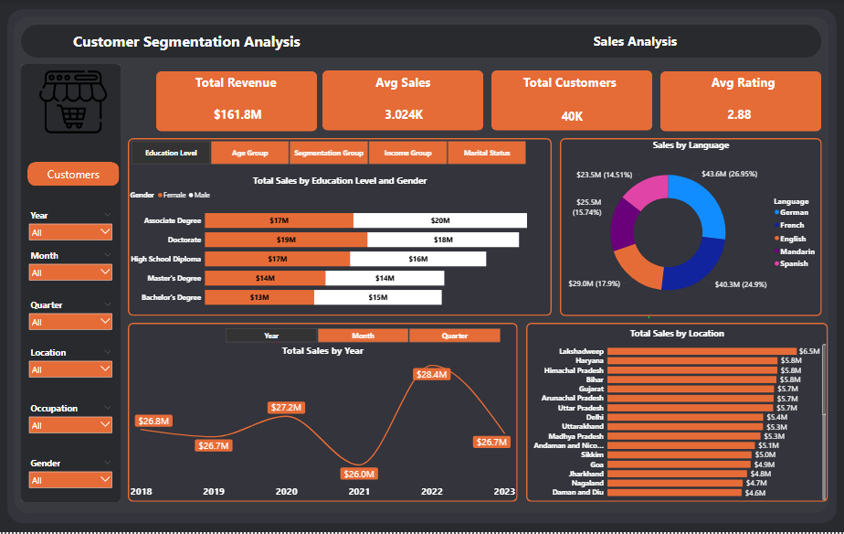
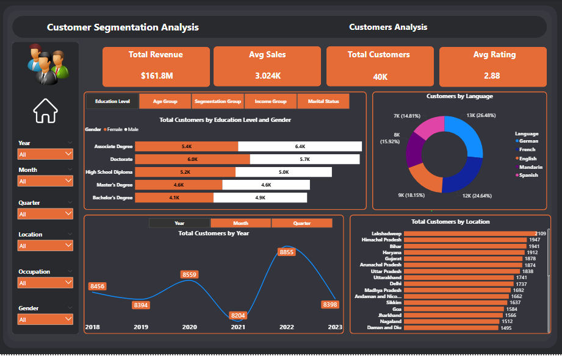

# 📊 Customer Segmentation and Sales Analysis
## Overview
The  objective of this project is to analyze customer behavior and sales performance across various demographic and segmentation dimensions. By leveraging customer segmentation analysis, the project aims to provide actionable insights into revenue trends, customer distribution, and overall business performance to support data-driven decision-making.

## 🔑 Key Insights
- Total Revenue: $161.8M

- Avg Sales: 3.024K

- Total Customers: 40K

- Avg Rating: 2.88
  
## Key Segments and High-Value Areas
**Education Level**
- Customers with an **Associate Degree** drive the highest **sales ($37M)**, then  with a **Doctorate ($37M)**.
- Customers with a  **Associate Degree**  for the highest **customer count** **(11.8K)**, then **Doctorate (11.7K)**

**Age Group**
- Customers from  **20-40** drive the highest **sales ($67M)**, then  from a **40-60 ($55M)**.
- Customers from  **20-40**   for the highest **customer count** **(20.8K)**, then from a **40-60 (17,5)**

**Segmentation Group**
- Customers belongs to **group 5** drive the highest **sales ($43M)**, then  **group 4 ($31M)**.
- Customers belongs to **group 5**  for the highest **customer count** **(13.4K)**, then**group 4 (9,8k)**

**Income Group**
- Customers have salaries from  **80k-110k** drive the highest **sales ($82M)**, then  from a **50k-80k ($42M)**.
- Customers have salaries from  **80k-110k**  for the highest **customer count** **(24.9K)**, then from a **40-60 (13,5k)**
  
**Marital Status**
- **Married Customers** drive the highest **sales ($40M)**, then   **Divorced Customers ($40M)**.
- **Married Customers**  for the highest **customer count** **(12.7K)**, then **Divorced Customers (11.7K)**

 ## Financial and Customer Trends
 The overall revenue trend from 2018 to 2023 shows significant volatility with a peak in 2022 and a recent decline.
 
- Revenue Peak: $28.4M in 2022.

- Customer Peak: 8,855 total customers in 2022.

- The year 2021 was  the lowest revenue ($26.0M) and the lowest number of customers (8,204).

- Both revenue and customer numbers experienced a drop in 2023 compared to the 2022 peak, landing at $26.7M and 8,398

##  Language Preference
  Both Sales and Total Customers are highest among the German and French language segments.

- **German:** Represents the largest segment for both **Sales (26.95%)** and **Customers (26.48%)**.

- **French:** Represents the second-largest segment for both **Sales (24.9%)** and **Customers (24.64%)**.

 ## Geographic Performance

- The top-contributing locations by **sales are Lakshadweep ($6.5M), Haryana ($5.8M), and Himachal Pradesh ($5.8M)**
- The top-contributing locations by **customer count are Lakshadweep (2,109), Himachal Pradesh (1,947), and Bihar (1,941)**

## 📸 Dashboard Preview
## Sales 

## Customer

 ## 📌 Conclusion
- **Targeted Marketing:** Focus marketing and retention efforts on **Doctorate and Associate Degree holders**, as they represent the most valuable and numerous customer segments.
- **Geographic Expansion:** Continue to invest in high-performing regions like Lakshadweep also exploring the  better ways to benfit from other regions
- **focus on marketing content and customer support in German and French**,  also exploring the  better ways to benfit from  the  customer base that uses other Languages. 

  
